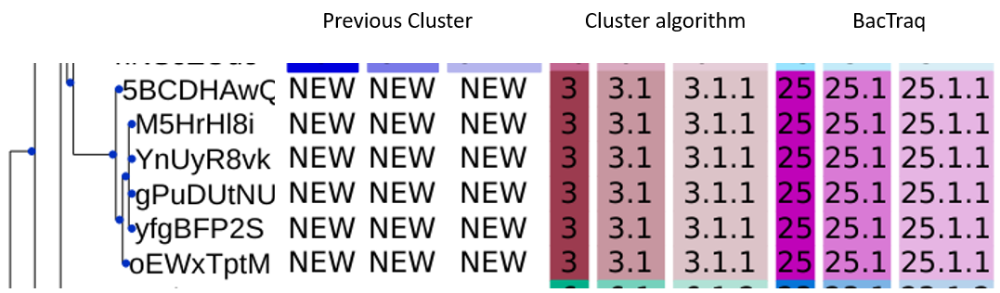

# BacTraq

SNP-based clustering with consistent naming.

## Intro:

BacTraq is a Python package designed to cluster, track and maintain consistent naming of clusters during SNP-based analysis. It compares clusters from the current sequencing run with those from previous analyses to determine whether clusters have remained the same or require new naming.

> [!IMPORTANT]
> The name structure is adapted to our in-house naming rule.
> With multiple threshold levels, the cluster name at X level is composed of all cluster numbers assigned to at the higher level. E.g: A sample is assigned cluster 1 at 20 level, cluster > 1 at 10 level and cluter 2 at 5 level, the input/output is:
> 
> |sample |20 SNPs|10 SNPs|5 SNPs|
> 
> |sample1|  1    |  1.1  | 1.1.2|
>
> If a sample is unclustered at a level, no number will be assigned to it for that level.
> E.g. Sample1 clusters at 20 SNP with cluster number 1, but don't cluster at level 10 and 5 threhold, then the output is `sample1,1,,`

### Key Features

- Cluster sequences based on their SNP distance gerenated by [SNP-dists](https://github.com/tseemann/snp-dists)

- Detects and handles overlapping clusters between sequencing runs.

- Identifies merge and split events for clusters.

- Provides consistent cluster naming for easy tracking across routine analyses.


## Installation

Create a new environment for BacTraq to install dependencies:

```bash
conda create -n bactraq python=3.10
```

**Git Clone**:

```bash
git clone https://github.com/qhgenomics/BacTraq.git
```

**Set up the code**:

```bash
cd BacTraq
pip install dist/*.whl
```

The package will be installed with dependencies. 

>[!NOTE]
> After `pip install` you can remove `BacTraq` folder to save space.

Run this command to see if the package is install:

```bash
bactraq --help
```

Output: 
```bash
usage: bactraq [-h] [-t THRESHOLD] [--history HISTORY] [--nRef] snpdist_matrix output

positional arguments:
  snpdist_matrix        Enter the path to SNPdist matrix.
  output                Save name file. Current support csv save file

options:
  -h, --help            show this help message and exit
  -t THRESHOLD, --threshold THRESHOLD
                        Enter your list of threshold. E.g: --threshold 20,10,5. Default: 20,10,5
  --history HISTORY     Enter the path to previous/databases clusters history parquet file. You can run `bactraq-history` with the previous cluster table to generate this file. If empty, will perform clustering analysis only.
  --nRef                No Reference sample in the SNP distance matrix.
```

## Basic usage

### Common run

To run the package with clusters' name tracking you will need to input snp-distance matrix file generated by SNPdists and history file in parquet format.

```bash 
bactraq cc152_snp_dists.tsv 20241210_snp_cluster.csv -t 20,10,5 --history 20241108_cc152_cluster.parquet.gz
```
### Input file

Bactraq takes the default output format of snp-dists which is a **tab-separated** file.

### History file:

If you do not have history.parquet.gz file. You can run `bactraq-history` to generate one. Input is a table of cluster in comma separated format. 
Run `bactraq-history -h` for more information.

Input example of `bactraq-history`:
```
sample,20 SNPs,10 SNPs,5 SNPs
SS24M01,10,10.1,10.1.1
SS24M02,10,10.2,10.2.1
SS24M03,8,8.1,8.1.1
SS24M04,8,8.1,8.1.1
SS24M05,8,8.1,
...
```

Command:
```bash 
bactraq-history 20241108_cc152_cluster.csv -o 20241108_cc152_history -t 20,10,5
```

Output:
``` 
History file: 20241108_cc152_history.parquet.gz
```

### Cluster Naming Rules

BacTraq evaluates pairwise overlaps between current and previous clusters at each threshold level, applying the following rules:

1. Merge Case:

If a current cluster overlaps with multiple previous clusters, it is considered a merge.

A new name is assigned to the merged cluster.


2. Split Case:

If multiple current clusters overlap with a single previous cluster, it is considered a split.

New names are assigned to each split cluster.


3. Entirely New Cluster Case:

If a current cluster contains only new samples and no overlap with previous clusters, it is considered entirely new.

A new name is assigned to the cluster.



4. Consistent Naming Case:

If a current cluster overlaps with only one previous cluster, including both shared and new samples, the previous name is retained.


Click here for full image [full result image](docs/bactraq_rename.png)

